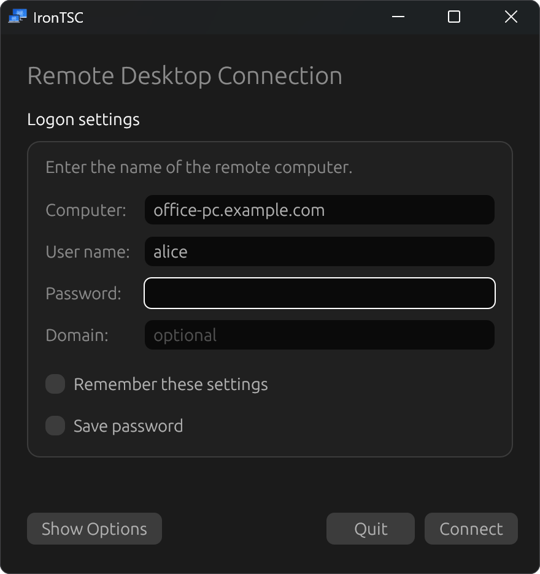
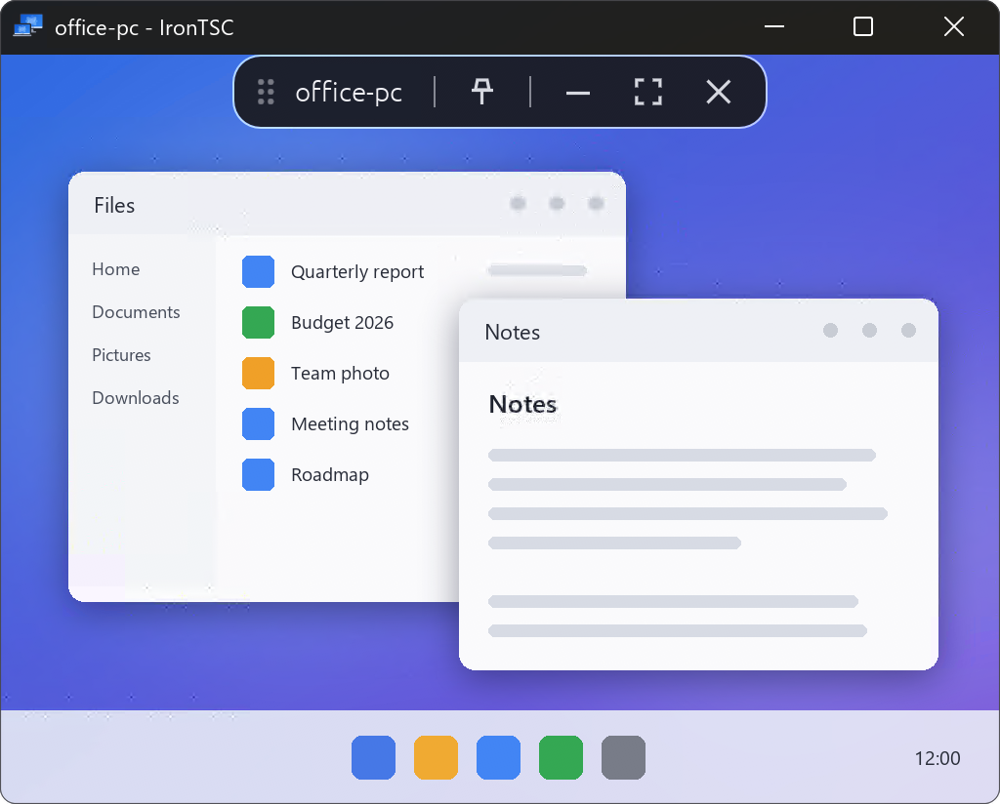

  

<h1 align="center">IronTSC</h1>

  A fast, native Remote Desktop client written in Rust, for Linux and Windows.

IronTSC connects to Windows machines over the Remote Desktop Protocol, with the
same simple dialog and floating connection bar you know from Microsoft's
Remote Desktop Connection (`mstsc`).

  
  &nbsp;
  

## Graphics over UDP

IronTSC speaks RDP's UDP transport (MS-RDPEUDP and MS-RDPEUDP2), the same
multitransport path Microsoft's own client uses: when the server offers it, the
desktop's graphics move to UDP, so a lost packet does not stall the whole
stream and the session stays responsive over Wi-Fi and long links. If UDP
cannot get through, the session carries on over TCP without you noticing.

## Features

- Saved `.rdp` connections, opened and saved the way `mstsc` does
- Modern RDP graphics (RDPEGFX) with dynamic resizing and fullscreen
- Clipboard for text, images and files, in both directions
- Sound from the remote machine, and optionally your microphone and camera
- Local folders shared into the session
- Follows the system's light and dark mode

## Download

Builds for **Windows** (MSI installer or portable ZIP) and **Linux** (`.tar.gz`)
are on the [Releases](https://github.com/espentveit/irontsc/releases) page.

To build it yourself, see [BUILD.md](BUILD.md).

## Kudos

IronTSC stands on the shoulders of others:

- **[IronRDP](https://github.com/Devolutions/IronRDP)** by Devolutions -- the
  Rust implementation of the protocol that IronTSC is built on.
- **[FreeRDP](https://github.com/FreeRDP/FreeRDP)** -- its ClearCodec and
  NSCodec decoders are ported here.
- **Microsoft's [Open Specifications](https://learn.microsoft.com/en-us/openspecs/windows_protocols/)**
  -- the protocol documents that make an independent client possible.
- **[egui](https://github.com/emilk/egui)**, **[winit](https://github.com/rust-windowing/winit)**
  and the wider Rust ecosystem for the window and everything in it.

## License

Licensed under either of [MIT](LICENSE-MIT) or [Apache-2.0](LICENSE-APACHE),
at your option. The ported FreeRDP codecs are Apache-2.0 only, and the
Microsoft protocol documents in `vendor/` are under Microsoft's own terms; see
[NOTICE](NOTICE).
